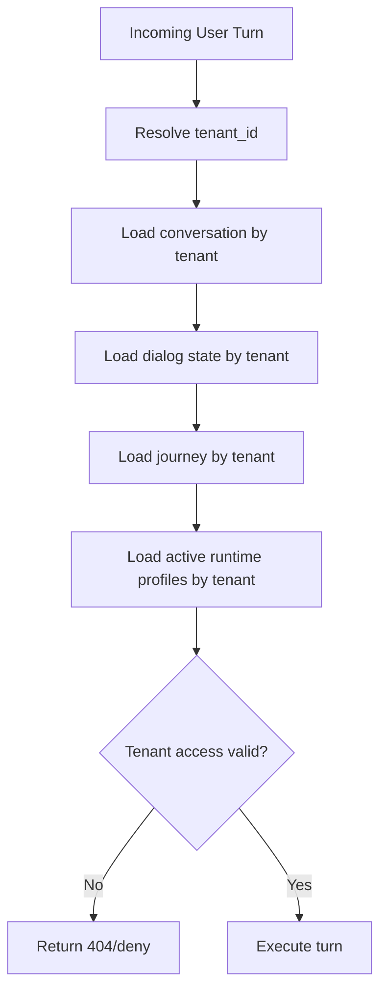
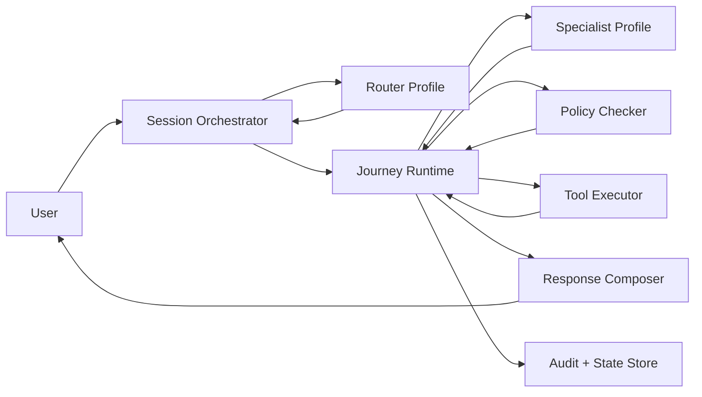
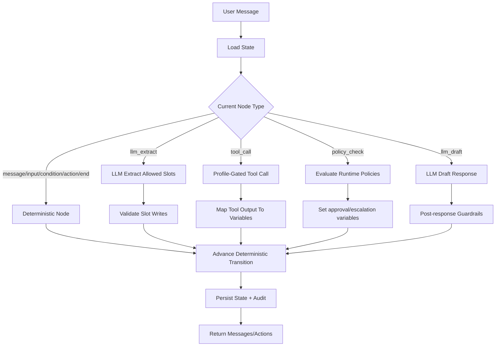
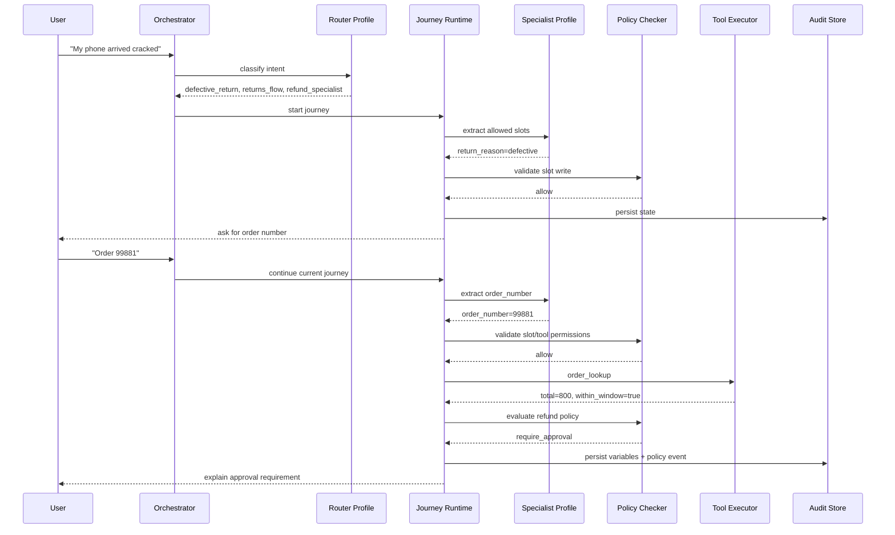

# Runtime Architecture

This document captures the intended runtime architecture for tenant-isolated, multi-turn, hybrid journey execution.

## Core Principle

Agents do not freely coordinate with each other. A single session orchestrator owns the turn, loads tenant-scoped configuration, invokes bounded runtime profiles when allowed, and commits state only after deterministic validation.

```text
Agents propose. Runtime commits.
```

## Tenant And Session Isolation

Every turn executes inside a tenant and conversation boundary:

```text
tenant_id + conversation_id + journey_id + runtime_profile_id
```

The runtime must verify that all loaded entities belong to the same tenant:

```text
request tenant
  == conversation.tenant_id
  == dialog_state.tenant_id
  == journey.tenant_id
  == runtime_profile.tenant_id
```



## Multi-Agent Runtime Model

The system uses runtime profiles instead of autonomous long-lived agents.



### Profile Types

Router profile:
- Maps user query to intent.
- Selects journey and specialist profile.
- Runs when no journey is active, or when rerouting is explicitly allowed.

Specialist profile:
- Extracts slots.
- Drafts responses.
- Proposes actions from allowed choices.
- Uses only allowed tools, journeys, and slots.

Policy profile/checker:
- Allows, denies, escalates, or requires approval.
- Runs before slot writes, tool calls, transitions, and final response.

Tool executor:
- Calls client APIs through allowlisted tools/contracts.
- Never runs directly from an LLM response.

## Hybrid Journey Execution

Hybrid mode is node-level. The deterministic journey owns state and transitions; LLMs assist only where the node explicitly allows them.



Supported hybrid node types:

```json
{
  "type": "llm_extract",
  "data": {
    "profile": "refund_specialist",
    "allowed_slots": ["refund_amount", "refund_reason"]
  }
}
```

```json
{
  "type": "tool_call",
  "data": {
    "profile": "refund_specialist",
    "tool": "order_lookup",
    "input": { "order_number": "{{order_number}}" },
    "output_map": {
      "within_return_window": "within_window",
      "total": "refund_amount"
    }
  }
}
```

```json
{
  "type": "policy_check",
  "data": {
    "profile": "refund_specialist"
  }
}
```

```json
{
  "type": "llm_draft",
  "data": {
    "profile": "refund_specialist",
    "instruction": "Explain the approval requirement empathetically.",
    "must_not_claim": ["refund approved"]
  }
}
```

## Multi-Turn Example



## Runtime Profile Shape

Runtime profiles are tenant-scoped configuration.

```json
{
  "name": "refund_specialist",
  "kind": "specialist",
  "allowed_journeys": ["refund_v2"],
  "allowed_tools": ["order_lookup", "process_refund"],
  "allowed_slots": ["order_number", "refund_amount", "refund_reason"],
  "guardrails": ["Never approve refunds over threshold"],
  "policies": [
    {
      "id": "refund_over_500",
      "effect": "require_approval",
      "when": { "op": "gt", "var": "refund_amount", "value": 500 },
      "reason": "Refund exceeds manager approval threshold"
    }
  ]
}
```

## Persistence

Important runtime tables:

- `journeys`: workflow graph, execution mode, variables.
- `dialog_states`: current node, session variables, history, context.
- `runtime_profiles`: tenant-scoped router/specialist/policy configuration.
- `journey_scenarios`: DB-backed scenario DSL/test packs.
- `simulation_runs`: scenario execution results.
- `messages`: conversation transcript.

## Current Code Anchors

- Journey validation: `src/lib/journey/schema.ts`
- Scenario DSL/runner: `src/lib/journey/scenario-runner.ts`
- Runtime profiles: `src/lib/runtime/profiles.ts`
- Tenant runtime loader: `src/lib/runtime/tenant-runtime.ts`
- Tenant guard: `src/lib/runtime/tenant-guard.ts`
- Node-level hybrid executor: `src/lib/runtime/hybrid-executor.ts`
- Dialog execute route: `src/app/api/dialog/execute/route.ts`
- Dialog stream route: `src/app/api/dialog/stream/route.ts`
